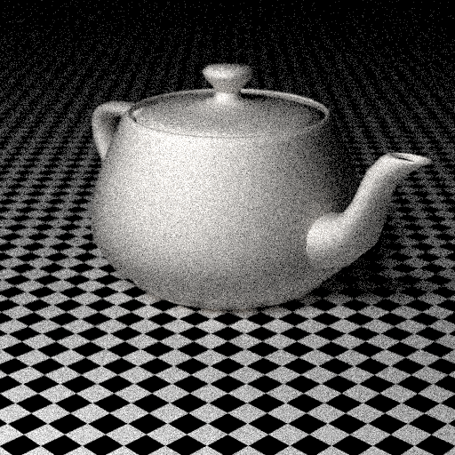

# Simple Rust raytracer

Based on wonderful series of books "Ray Tracing in One Weekend" by Peter Shirley et al.
I wrote it a while ago, using old version of everything, both book and Rust itself.
Also, I'm not any good in Rust, so don't consider my code to be an exemplar of best practices.
With that being said, you can launch this program like this

```
cargo run PATH_TO_SCENE PATH_TO_OUTPUT

# e.g. cargo run scenes/basic.json out.png
```

Basic scenes and objects could be found in 'scenes' folder. I honestly don't remember where did I get
the format for the scene, but it's pretty straightforward. Obj files support is quite limited, but let's
hope it'll get fixed in the future.

Noisy sample output:

scene/basic.json


scene/teapot.json



## external dependencies

Because of rfd we need to install additional backends, see [documentation](https://docs.rs/rfd/latest/rfd/#linux--bsd-backends)
